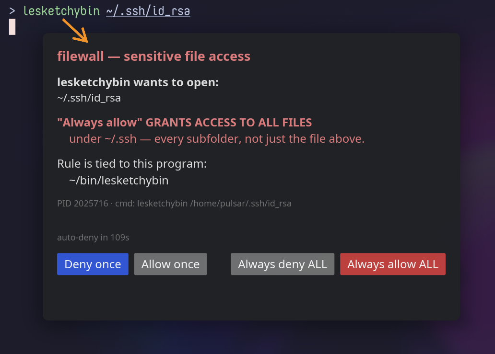

# filewall

Synchronous, object-centric prompting for sensitive file access on Linux.



When an unknown binary tries to `open()` a watched file (e.g. `~/.ssh/id_ed25519`),
the kernel **blocks the syscall** and a desktop prompt asks you to allow or deny it
in real time. This mitigates supply-chain attacks (malicious npm/pip/cargo
postinstall scripts, compromised dev tools) that try to read developer secrets — the
policy is attached to the *file*, with an allowlist of binaries permitted to read it,
rather than to each binary.

Built on Linux `fanotify` permission events (`FAN_OPEN_PERM`), which are the only
primitive that synchronously blocks a syscall pending a userspace decision. 

> **Status: beyond MVP.** The full chain works end-to-end, "Always allow/deny"
> decisions persist as learned rules, and the daemon + UI ship as systemd services
> with an Arch [`PKGBUILD`](packaging/PKGBUILD). Some spec features remain
> deferred — see *Deferred* below.

## Components

| Crate / binary | Privilege | Role |
|----------------|-----------|------|
| `filewalld`      | root (`CAP_SYS_ADMIN`) | Marks watched paths (single files directly; directories via `FAN_EVENT_ON_CHILD`, so new files and atomically-renamed files are covered automatically and new subdirs are live-marked via inotify), evaluates accesses against the allowlist **and learned rules**, asks the UI on a miss, persists "Always" decisions, answers the kernel. |
| `filewall-ui-iced` | user session | **Default UI.** Renders the scope-aware prompt natively (iced, software-rendered) — showing whether an "Always" rule will cover one file or a whole tree — and returns the decision. No external GUI dependency. |
| `filewall-ui`    | user session | Alternative UI that renders the same prompt via the external **yad** dialog. Mutually exclusive with `filewall-ui-iced` (only one may hold the daemon's prompt socket). |
| `filewallctl`    | user (root for live paths) | Lists/removes learned rules; dumps watched objects; reloads (`SIGHUP`) and reports daemon status. JSON/YAML/table output. |
| `filewall-proto` | library | Shared length-prefixed-JSON IPC types. |
| `filewall-rules` | library | Learned-rule schema, atomic `rules.toml` store, deny-wins matcher (shared by daemon + ctl). |

The two processes talk over a Unix socket (`/run/filewall/prompt.sock`). Keeping the
privileged daemon minimal and rendering the GUI as the unprivileged user is the whole
point of the split — root can't (and shouldn't) pop a dialog into your session.

## How a decision is made

1. Kernel fires a `FAN_OPEN_PERM` event on a guarded file — via the file's own mark,
   or its parent directory's `FAN_EVENT_ON_CHILD` mark — and blocks the opener. A path
   matching the watch's `exclude` globs is allowed immediately, without a prompt.
2. Daemon resolves the accessing process **race-free** via the event's pidfd
   (`/proc/<pid>/exe`, `/proc/<pid>/cmdline`, `/proc/<pid>/cwd`).
3. The config `allow` globs and the persisted **learned rules** are evaluated
   together, **deny-wins**:
   - any matching deny → `FAN_DENY`
   - else any matching allow (config glob or learned rule) → `FAN_ALLOW`
   - else → prompt the user, who picks **Allow once / Deny once / Always allow /
     Always deny**. The dialog states exactly what an "Always" choice will
     persist — just the file shown, or the whole watched tree (per `learn_object`),
     and the program the rule is tied to — with a prominent warning when the grant
     would cover an entire tree. The choice is persisted to `rules.toml` (and
     applied immediately). The default keyboard action (Enter/Escape) is the
     fail-closed **Deny once**.
   - no answer within `prompt_timeout_seconds` → **deny** (fail-closed)
4. A denied open returns **`EPERM`** ("Operation not permitted") to the caller.

**Startup & fail-closed.** The daemon places its marks **immediately at startup**,
before any UI has connected — so guarded files are protected from the moment
`filewalld` is running (e.g. at boot, before anyone logs in). While no UI
is connected, any access that *would* prompt is **denied** (fail-closed); the daemon
picks up the UI the moment it connects (it keeps listening and re-accepts a dropped
link non-blockingly). On a packaged install the system daemon starts at boot and the
per-user UI starts with the graphical session.

A learned rule pins the **literal** executable path (the trust anchor) to either
the triggering file or the whole watched tree (`learn_object`), optionally
constrained by the process working directory (`learn_match = ["exe","cwd"]`). `cwd`
is attacker-controllable, so it narrows prompts but is never a security boundary;
learned rules are never auto-generalized into globs.

## Prerequisites

- **Rust** (stable) with `cargo` — to build the workspace.
- **Linux with fanotify permission events.** `filewalld` runs as root
  (`CAP_SYS_ADMIN`); `FAN_OPEN_PERM` is a Linux-only primitive.
- **A graphical session.** The default UI (`filewall-ui-iced`) renders natively
  and needs no external dialog tool — only the usual session libraries (`libxkbcommon`,
  plus `wayland` or `libx11` for your session type). If the UI can't reach a display
  it **fails closed (denied)**.
- **[`yad`](https://github.com/v1cont/yad)** — *only* for the alternative
  `filewall-ui` (yad) variant: `sudo pacman -S yad` (Arch) · `sudo apt install yad`
  (Debian/Ubuntu). Not needed for the default native UI.

## Build & test

```sh
cargo build --release
cargo test    # unit/integration tests: policy, config, directory marking, treewatch, rules, proto, UI link
```

## Installation

### Arch Linux (PKGBUILD)

The [`packaging/`](packaging/) directory holds the systemd units, the config
template, and a `PKGBUILD`. The shipped `PKGBUILD` is a **local working-tree
build** — it compiles the checkout it lives in (including uncommitted changes),
which is convenient for iterating but not chroot-clean:

```sh
cd packaging
makepkg -si        # build + install filewall (native UI; yad is an optdepend)
```

This installs the binaries to `/usr/bin/`, the config template to
`/etc/filewall/config.toml` (a pacman `backup` file — your edits survive upgrades,
new options arrive as `.pacnew`), and the units below.

### Enabling the services

filewall is two systemd scopes — a **system** daemon and a **per-user** UI:

```sh
# 1. Edit the config (absolute paths — see the ~ note under Configuration):
sudoedit /etc/filewall/config.toml

# 2. Start the privileged daemon (system-wide, runs as root):
sudo systemctl enable --now filewalld.service

# 3. Start the prompt UI in your graphical session (per-user, native default):
systemctl --user enable --now filewall-ui-iced.service
#    ...or the yad-based UI instead (never both — they Conflict=):
#    systemctl --user enable --now filewall-ui.service
```

The daemon's `RuntimeDirectory`/`StateDirectory` provide `/run/filewall` (socket +
pidfile) and `/var/lib/filewall` (learned `rules.toml`) automatically.

> **Bare window managers:** if your WM doesn't import the session environment into
> the systemd user manager, the prompt UI won't see `$DISPLAY`/`$WAYLAND_DISPLAY`.
> Add to your session startup (e.g. `~/.xinitrc`):
> `systemctl --user import-environment DISPLAY WAYLAND_DISPLAY XAUTHORITY DBUS_SESSION_BUS_ADDRESS`.
> A missing display degrades safely — the UI fails closed (deny).

> **Large trees:** if `journalctl -u filewalld` shows mark/watch-limit warnings,
> raise `fs.fanotify.max_user_marks` and `fs.inotify.max_user_watches` via
> `/etc/sysctl.d/` (the package's post-install message shows the exact commands).

## Configuration

A watch on a directory marks the directory itself (with `FAN_EVENT_ON_CHILD`), so
its files are covered with one kernel mark per directory rather than one per file —
**newly-created files and atomically-renamed files are covered automatically**, and
new sub-directories are live-marked as they appear. A watch on a single file marks
that file directly.

`config.toml` (see [`example_config.toml`](example_config.toml) for every option,
fully commented):

```toml
default_action = "prompt"          # prompt | allow | deny (global; no per-watch default)
prompt_timeout_seconds = 30
socket_path = "/run/filewall/prompt.sock"
rules_path  = "/var/lib/filewall/rules.toml"   # where "Always" decisions persist

[[watch]]
path = "/home/you/.ssh"            # ~ expands to the daemon's $HOME; symlinked roots are canonicalized
allow = ["/usr/bin/ssh", "/usr/bin/ssh-*", "/usr/bin/git"]
exclude = ["**/Cache"]             # prune noisy subtrees; file globs auto-allow at access time
patterns = []                      # empty = guard the whole tree; see below to scope by filename
learn_object = "file"              # "file" | "tree" — scope of an "Always" rule
learn_match  = ["exe"]             # add "cwd" to pin the working directory too
```

Glob semantics: `*` does not cross `/`; `**` does.

**Scoping a watch to a class of files (`patterns`).** To guard, say, only the
shell-history files in an otherwise-uninteresting directory without listing each
one, set `patterns` (globs matched *relative to* `path`). Empty (the default)
guards the whole tree. The pattern's shape decides how much gets marked:

```toml
[[watch]]
path = "/home/you"                 # $HOME holds thousands of unrelated files
allow = []
patterns = [".zsh_history", ".bash_history", "*_history"]   # shallow → ONE mark on ~
learn_object = "file"
```

- A **shallow** pattern (`*_history`, no `/` or `**`) matches only files *directly*
  in the dir, so filewalld marks **just that one directory** — one fanotify mark,
  and robust to the atomic temp+rename that zsh/bash use to rewrite history (a
  single-file mark would be orphaned by the rename; the directory mark is not).
- A **deep** pattern (`**/*_history`, or anything containing `/`) matches at any
  depth and therefore marks the **entire subtree** (one mark + one inotify watch per
  sub-directory). filewalld logs a warning at load for each deep pattern — a careless
  `**` can exhaust `fs.fanotify.max_user_marks` / `fs.inotify.max_user_watches` and
  leave *other* watches unmarked. `exclude` still prunes noisy subtrees from the walk.

Children matching none of the `patterns` are auto-allowed at access time (the
mirror of `exclude`).

> **`~` resolves to the *daemon's* home.** As a system service `filewalld` runs as
> **root**, so `~` expands to `/root`, not your login home. To guard a user's files
> under the packaged service, write the **absolute** path (e.g. `/home/alice/.ssh`).
> The shipped `/etc/filewall/config.toml` is a commented template with no active
> watches, so the daemon starts clean and guards nothing until you opt in.

Run the daemon (dev): `sudo ./target/release/filewalld /path/to/config.toml`
Run the UI (dev):     `./target/release/filewall-ui-iced`

> The native UI needs a graphical session but no external dialog tool, and follows
> the desktop's light/dark preference (read from xdg-desktop-portal's
> `org.freedesktop.appearance` `color-scheme`). A broad (whole-tree) "Always allow"
> grant is shown with a prominent red warning so it is visually distinct from a
> single-file one. Pass `--demo` to preview the prompt without a running daemon. The
> yad variant (`./target/release/filewall-ui`) is an alternative that instead needs
> **`yad`** in the session.

For a packaged install that runs both as managed services, see
[Installation](#installation).

## Managing learned rules

```sh
filewallctl list                 # show persisted "Always" decisions (with stable IDs)
filewallctl dump                 # show what the daemon is currently protecting
filewallctl remove <id> [id...]  # revoke one or more by ID, then auto-reloads the daemon
filewallctl reload               # SIGHUP the daemon to re-read config + rules
filewallctl status               # is filewalld running?
```

Each rule carries a stable `ID` (shown by `list`) that never changes when other
rules are removed, so `list` output is safe to drive automation. `remove` takes
one or more of those IDs and applies them in a single pass; it exits non-zero if
any given ID matched no rule. The daemon also re-reads its config and
`rules.toml` on `SIGHUP`.

```sh
# revoke every rule for a given exe in one call
filewallctl list --json | jq -r '.[] | select(.exe == "/usr/bin/node") | .id' \
  | xargs -r filewallctl remove
```

### Output formats

Every `filewallctl` command accepts a global `--json`, `--yaml`, or `--table`
flag (anywhere on the command line). `--table` is the default — including when
output is piped, so a script must pass `--json`/`--yaml` explicitly.

```sh
filewallctl dump --json | jq '.objects[] | select(.fanotify == false)'
```

### `filewallctl dump`

Live-queries the running daemon over its control socket
(`control_socket_path`, default `/run/filewall/control.sock`) for every object
it is currently protecting — including subdirectories discovered at runtime.
Columns:

| Column      | Meaning                                                                 |
|-------------|------------------------------------------------------------------------|
| `PATH`      | The marked file or directory.                                          |
| `KIND`      | `file` (single inode) or `dir` (`FAN_EVENT_ON_CHILD` mark).            |
| `RECURSIVE` | Whether the covering watch recurses into new subdirectories.           |
| `FANOTIFY`  | The security mark — `no` is a coverage gap (e.g. ENOSPC on the limit). |
| `LIVE`      | inotify watch present so new subdirs are live-marked; `-` for files.   |
| `WATCH`     | The covering config `[[watch]]` root.                                  |

## Deferred (post-MVP)

Core daemon/UI:
- mount/filesystem-wide marking.
- multi-user / per-user sockets and `SO_PEERCRED`. The daemon holds a **single** UI
  link over one global `0o666` socket, so it serves **one interactive user at a
  time** — fast-user-switching / multi-seat is not supported.
- privilege drop after init (the daemon stays root for its lifetime).
- `notify-send` UI variant (the UI ships as a native `filewall-ui-iced` and a
  `yad`-based `filewall-ui`; a lightweight `notify-send` variant is still deferred).

Packaging (recommended follow-ups identified while adding the systemd/PKGBUILD support):
- **Tighten the daemon unit's sandbox.** `packaging/systemd/filewalld.service`
  intentionally ships with only seccomp/capability hardening; mount-namespace
  directives are omitted because they can blind a daemon that must see the whole
  filesystem and every process's `/proc`. Worth testing, one at a time, whether
  `ProtectSystem=strict` (read-only fs — the daemon only *reads* watched inodes) can
  be enabled without breaking fanotify. `ProtectHome`/`ProtectProc` are expected to
  break it and must stay off.
- **A reproducible PKGBUILD variant.** The shipped `PKGBUILD` builds the local
  working tree. Add a tagged-release (tarball) or VCS (`-git`) variant for
  chroot-clean, reproducible builds once the project is tagged.
- **Commit `Cargo.lock`.** It is currently git-ignored; committing it is a
  prerequisite for reproducible packaged builds (the `PKGBUILD` builds with
  `--locked`).
- **Ship man pages.** The units reference no `Documentation=` because none exist
  yet; add `man` pages for `filewalld`/`filewall-ui`/`filewallctl` and wire them up.
